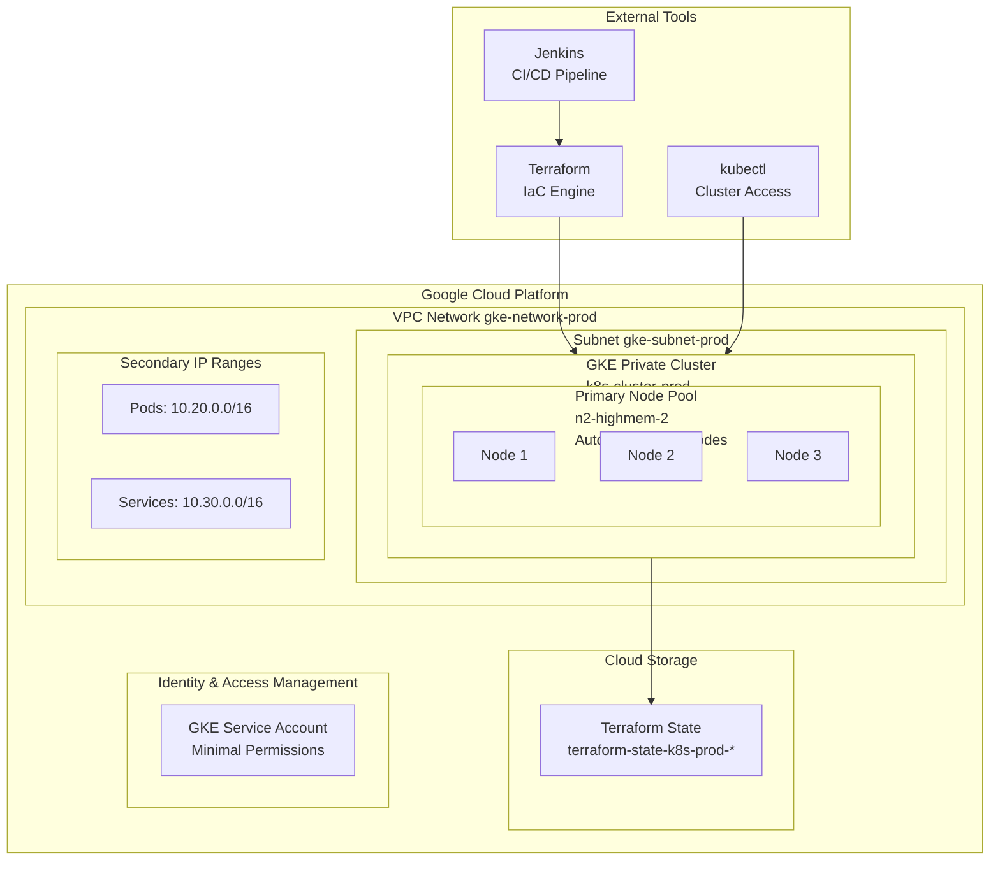

# Infrastructure as Code - Kubernetes Cluster en Google Cloud Platform

## Introducción

Este proyecto implementa **Infrastructure as Code (IaC)** utilizando Terraform para desplegar y gestionar un cluster de Google Kubernetes Engine (GKE) en Google Cloud Platform. La infraestructura está diseñada para soportar una arquitectura de microservicios con alta disponibilidad, escalabilidad y seguridad.

### Principios de Infrastructure as Code

- **Versionado**: Toda la infraestructura está definida en código y versionada en Git
- **Reproducibilidad**: La infraestructura puede ser recreada de manera consistente
- **Automatización**: Despliegues automatizados a través de pipelines de CI/CD
- **Inmutabilidad**: Los cambios se realizan reemplazando recursos, no modificándolos
- **Documentación como Código**: La documentación vive junto al código de infraestructura

## Arquitectura de la Infraestructura

### Componentes Principales



### Especificaciones Técnicas

#### Red y Conectividad
- **VPC**: Red privada personalizada con subnets dedicadas
- **Subnet Principal**: `10.10.0.0/16` para nodos del cluster
- **Pods Range**: `10.20.0.0/16` para pods de Kubernetes
- **Services Range**: `10.30.0.0/16` para servicios de Kubernetes
- **Cluster Privado**: Nodos sin IPs públicas para mayor seguridad

#### Compute y Escalabilidad
- **Tipo de Máquina**: `n2-highmem-2` (2 vCPUs, 16 GB RAM)
- **Auto-scaling**: 3-5 nodos según demanda
- **Disco**: 30 GB SSD estándar por nodo
- **Imagen**: Container-Optimized OS (COS) con containerd

#### Kubernetes
- **Versión**: Última versión estable de GKE
- **Modo Regional**: Alta disponibilidad en múltiples zonas
- **Auto-repair**: Reparación automática de nodos
- **Auto-upgrade**: Actualizaciones automáticas del cluster

## Estructura del Proyecto

```
k8s-cluster-terraform/
├── main/                           # Módulo reutilizable de Terraform
│   ├── main.tf                    # Configuración principal del cluster
│   ├── variables.tf               # Variables del módulo
│   └── outputs.tf                 # Outputs del módulo
├── prod/                          # Ambiente de producción
│   ├── main.tf                   # Configuración específica de prod
│   ├── backend.tf                # Configuración del estado remoto
│   └── kubeconfig-prod           # Archivo de configuración de kubectl
├── stage/                         # Ambiente de staging
│   ├── main.tf                   # Configuración específica de stage
│   └── backend.tf                # Configuración del estado remoto
├── Jenkinsfile                    # Pipeline de CI/CD
└── README.md                     # Esta documentación
```

### Patrón de Módulos

El proyecto utiliza el **patrón de módulos de Terraform** para promover la reutilización y mantenibilidad:

- **Módulo `main/`**: Contiene la lógica reutilizable para crear el cluster
- **Ambientes `prod/` y `stage/`**: Instancian el módulo con configuraciones específicas
- **Separación de responsabilidades**: Cada ambiente tiene su propio estado y configuración

## Configuración de Terraform

#### Variables Principales
- `project_id`: ID del proyecto de Google Cloud
- `env_name`: Nombre del ambiente (prod, stage)
- `cluster_name`: Nombre base del cluster
- `instance_type`: Tipo de máquina para los nodos
- `min_count` / `max_count`: Límites de auto-scaling
- `region`: Región de Google Cloud


## Gestión del Estado Remoto

### Configuración del Backend

El estado de Terraform se almacena de forma remota en **Google Cloud Storage** para garantizar:

- **Colaboración**: Múltiples desarrolladores pueden trabajar en la misma infraestructura
- **Consistencia**: Estado centralizado y versionado
- **Seguridad**: Cifrado en tránsito y en reposo
- **Durabilidad**: Respaldo automático y alta disponibilidad

#### Configuración del Backend (`backend.tf`)
```hcl
terraform {
  backend "gcs" {
    bucket = "terraform-state-k8s-prod-beaming-pillar-461818-j7"
    prefix = "terraform/state"
  }
}
```

### Configuración Inicial del Backend

Para configurar el backend de estado remoto por primera vez:

#### 1. Crear Buckets de Estado
```bash
# Variables de configuración
PROJECT_ID="beaming-pillar-461818-j7"
ENVIRONMENTS=("prod" "stage")

# Crear buckets para cada ambiente
for ENV in "${ENVIRONMENTS[@]}"; do
    BUCKET_NAME="terraform-state-k8s-${ENV}-${PROJECT_ID}"
    
    # Crear bucket
    gsutil mb -p ${PROJECT_ID} -c STANDARD -l us-central1 gs://${BUCKET_NAME}
    
    # Habilitar versionado
    gsutil versioning set on gs://${BUCKET_NAME}
    
done
```

#### 2. Inicializar Terraform
```bash
# En cada directorio de ambiente
cd prod/
terraform init

cd ../stage/
terraform init
```

### Características del Estado Remoto

- **Versionado**: Cada cambio crea una nueva versión del estado
- **Bloqueo**: Previene modificaciones concurrentes
- **Cifrado**: Estado cifrado automáticamente en GCS
- **Lifecycle Policy**: Limpieza automática de versiones antiguas (30 días)

## Pipeline de CI/CD

### Características del Pipeline

#### Automatización
- **Validación**: Terraform plan antes de aplicar cambios
- **Aprobación manual**: Gate de seguridad para cambios en producción

#### Seguridad
- **Credenciales seguras**: Service accounts con permisos mínimos
- **Secrets management**: Variables sensibles en Jenkins Credentials
- **Audit trail**: Log completo de todas las operaciones
- **Isolation**: Cada ambiente tiene su propio pipeline

#### Operaciones Soportadas
- **Plan**: Previsualizar cambios sin aplicarlos
- **Apply**: Aplicar cambios a la infraestructura
- **Destroy**: Eliminar infraestructura (solo para testing)

### Configuración del Pipeline

#### Variables de Ambiente
```bash
# Variables requeridas en Jenkins
GOOGLE_APPLICATION_CREDENTIALS  # Path al service account key
TF_VAR_project_id              # ID del proyecto de GCP
ENVIRONMENT                    # Ambiente objetivo (prod/stage)
ACTION                         # Acción a ejecutar (plan/apply/destroy)
```

#### Flujo de Ejecución
1. **Checkout**: Descarga el código desde Git
2. **Setup**: Configura credenciales y herramientas
3. **Init**: Inicializa Terraform con el backend remoto
4. **Plan**: Genera y muestra el plan de ejecución
5. **Approval**: Espera aprobación manual (solo para apply)
6. **Apply**: Ejecuta los cambios planificados
7. **Output**: Genera kubeconfig y outputs necesarios

## Ambientes y Configuración

### Estrategia Multi-Ambiente

El proyecto soporta múltiples ambientes con configuraciones específicas:

#### Ambiente de Producción (`prod/`)
- **Propósito**: Cargas de trabajo de producción
- **Configuración**: Alta disponibilidad y performance
- **Instancias**: `n2-highmem-2` (2 vCPUs, 16 GB RAM)
- **Escalabilidad**: 3-5 nodos
- **Monitoreo**: Completo con alertas

#### Ambiente de Staging (`stage/`)
- **Propósito**: Testing y validación pre-producción
- **Configuración**: Réplica de producción con recursos reducidos
- **Instancias**: `n2-standard-2` (2 vCPUs, 8 GB RAM)
- **Escalabilidad**: 1-3 nodos
- **Monitoreo**: Básico para testing

### Configuración por Ambiente

#### Diferencias Clave
| Aspecto | Producción | Staging |
|---------|------------|---------|
| Tipo de Máquina | n2-highmem-2 | n2-standard-2 |
| Nodos Mínimos | 3 | 1 |
| Nodos Máximos | 5 | 3 |
| Disco por Nodo | 30 GB | 20 GB |

#### Promoción entre Ambientes
1. **Desarrollo** → **Staging**: Automático via pipeline
2. **Staging** → **Producción**: Manual con aprobación
3. **Validación**: Testing completo en staging antes de producción

## Seguridad y Mejores Prácticas

### Seguridad de la Infraestructura

#### Cluster Privado
- **Nodos privados**: Sin IPs públicas
- **Endpoint privado**: Acceso controlado al API server
- **Authorized networks**: Lista blanca de IPs autorizadas
- **Network policies**: Segmentación de tráfico entre pods

#### Identity and Access Management (IAM)
```hcl
# Service Account con permisos mínimos
resource "google_service_account" "gke_service_account" {
  account_id   = "gke-${var.env_name}-sa"
  display_name = "GKE ${var.env_name} Service Account"
}

# Roles mínimos necesarios
resource "google_project_iam_member" "gke_service_account_roles" {
  for_each = toset([
    "roles/logging.logWriter",
    "roles/monitoring.metricWriter",
    "roles/monitoring.viewer",
    "roles/stackdriver.resourceMetadata.writer"
  ])
  
  project = var.project_id
  role    = each.value
  member  = "serviceAccount:${google_service_account.gke_service_account.email}"
}
```

#### Cifrado y Secretos
- **Cifrado en tránsito**: TLS para toda la comunicación
- **Cifrado en reposo**: Discos y estado de Terraform cifrados
- **Secrets management**: Google Secret Manager para datos sensibles
- **Rotación de claves**: Automática para service accounts

### Mejores Prácticas de Terraform

#### Estructura de Código
- **Módulos reutilizables**: Separación entre lógica y configuración
- **Variables tipadas**: Validación de inputs
- **Outputs documentados**: Información clara de recursos creados
- **Versionado de providers**: Versiones específicas para reproducibilidad

#### Gestión de Estado
- **Estado remoto**: Almacenamiento centralizado en GCS
- **Bloqueo de estado**: Prevención de modificaciones concurrentes
- **Backup automático**: Versionado y retención de estados anteriores
- **Separación por ambiente**: Estados independientes para cada ambiente

#### Seguridad del Código
- **Secrets en variables**: No hardcodear credenciales
- **Validación de inputs**: Constraints en variables
- **Least privilege**: Permisos mínimos necesarios
- **Audit trail**: Log de todas las operaciones

## Operaciones y Mantenimiento

### Operaciones Diarias

#### Monitoreo de la Infraestructura
```bash
# Verificar estado del cluster
kubectl get nodes
kubectl get pods -A

# Verificar métricas de recursos
kubectl top nodes
kubectl top pods -A

# Verificar estado de Terraform
terraform state list
terraform show
```

#### Acceso al Cluster
```bash
# Configurar kubectl con el kubeconfig generado
export KUBECONFIG=./kubeconfig-prod

# Verificar conectividad
kubectl cluster-info
kubectl get namespaces
```

### Operaciones de Mantenimiento

#### Actualizaciones del Cluster
```bash
# Verificar versiones disponibles
gcloud container get-server-config --region=us-central1

# Actualizar a través de Terraform
# Modificar la versión en variables.tf y ejecutar pipeline
```

#### Escalado Manual
```bash
# Escalar node pool temporalmente
gcloud container clusters resize k8s-cluster-prod \
  --node-pool primary-node-pool \
  --num-nodes 4 \
  --region us-central1
```

#### Backup y Recuperación
```bash
# Backup del estado de Terraform
terraform state pull > backup-$(date +%Y%m%d).tfstate

# Backup de configuraciones de Kubernetes
kubectl get all -A -o yaml > k8s-backup-$(date +%Y%m%d).yaml
```

### Troubleshooting

#### Problemas Comunes

**Error: Backend not found**
```bash
# Solución: Crear el bucket de estado
gsutil mb gs://terraform-state-k8s-prod-beaming-pillar-461818-j7
terraform init -reconfigure
```

**Error: Permission denied**
```bash
# Solución: Verificar service account
gcloud auth list
gcloud auth application-default login
```

**Error: Resource already exists**
```bash
# Solución: Importar recurso existente
terraform import google_container_cluster.primary projects/PROJECT_ID/locations/LOCATION/clusters/CLUSTER_NAME
```

#### Comandos Útiles
```bash
# Verificar configuración de Terraform
terraform validate
terraform fmt -check

# Verificar drift de configuración
terraform plan -detailed-exitcode

# Refrescar estado
terraform refresh

# Ver outputs
terraform output
```


